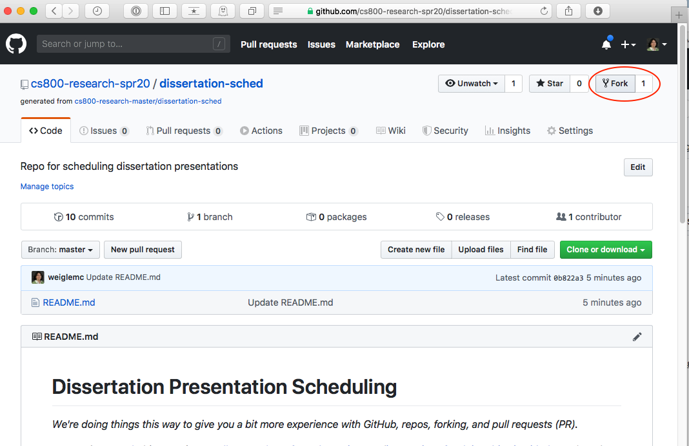
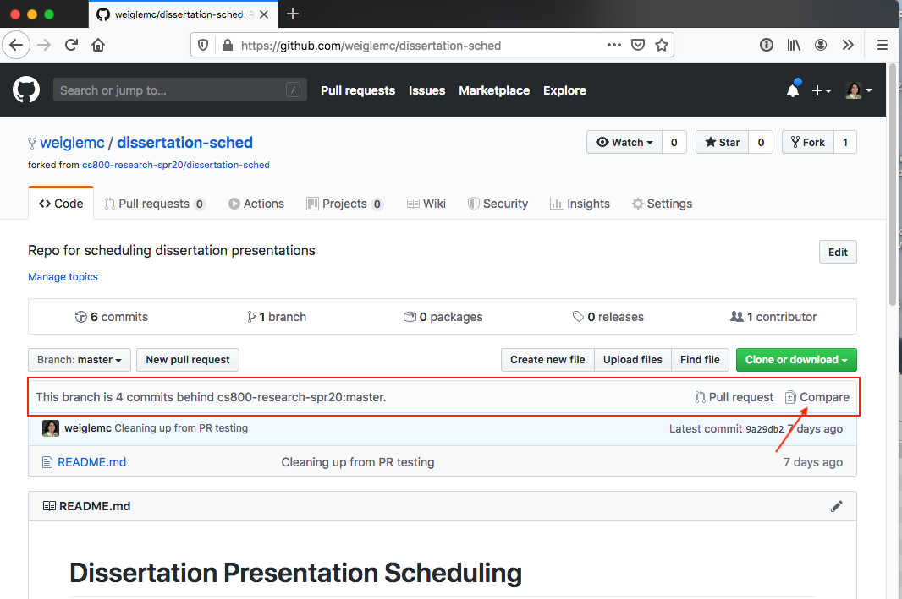
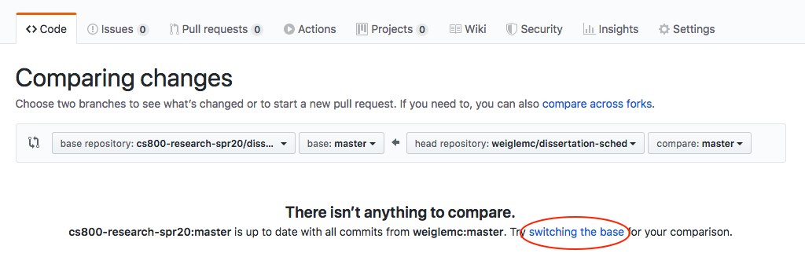
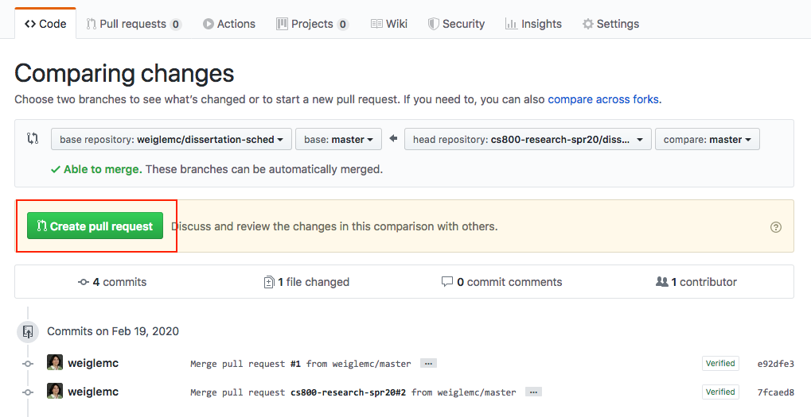
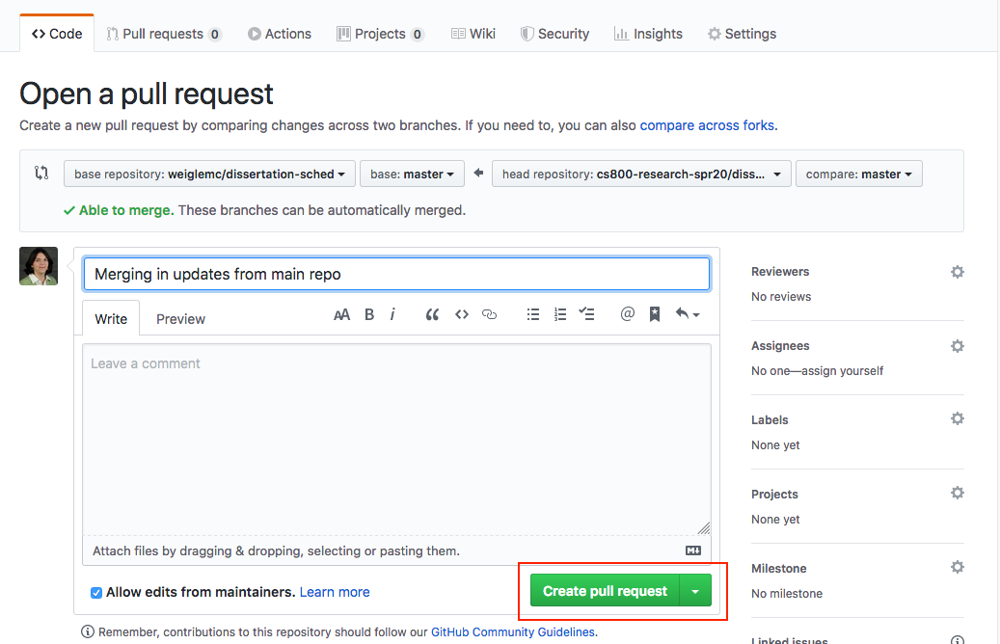
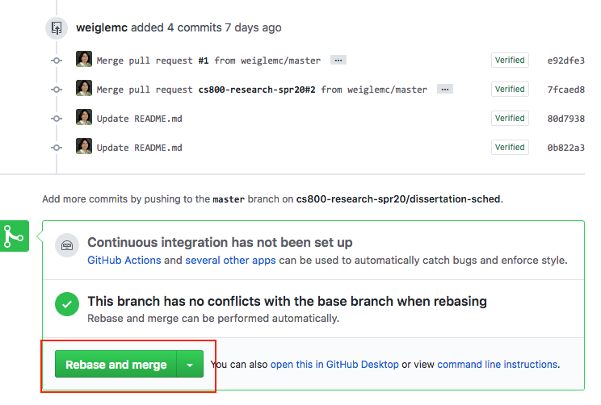
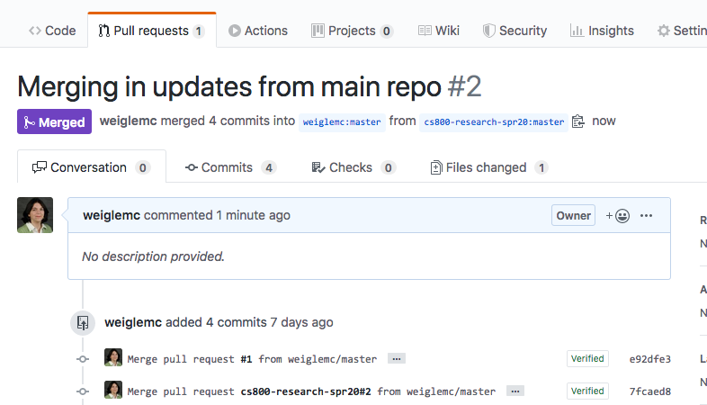
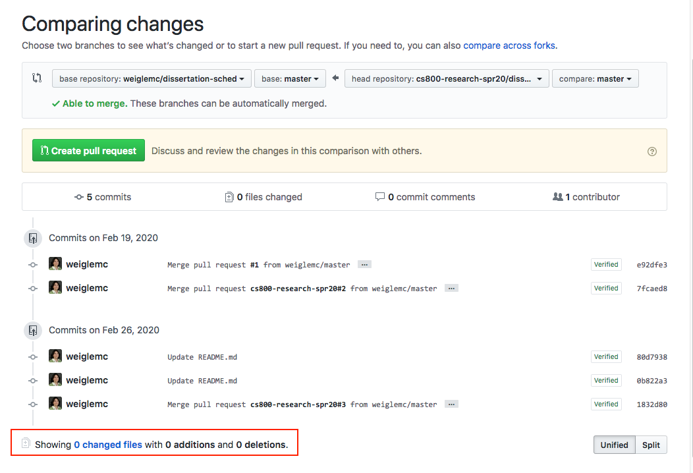

# Steps for Editing the Dissertation Presentation Schedule

##  Fork this repository
(Reference: https://help.github.com/en/github/getting-started-with-github/fork-a-repo)

Open the repo (https://github.com/cs800-research-spr20/dissertation-sched) and click the **Fork** button.  This will create a copy of this repo in your own GitHub account.

##  Pull updates from the main repo

Between the time you've forked the repo and when you're ready to make your updates, there may have been changes to the files.  I may have made an adjustment, or another student may have made an adjustment.  So, before you make any edits, make sure that you have the latest version of the repo.

*The directions below are showing how to do this via github.com, but if you're comfortable with git on the command-line and have checked out a local copy of your forked repo, then this process is much easier, as described at  https://help.github.com/en/github/collaborating-with-issues-and-pull-requests/merging-an-upstream-repository-into-your-fork*

(Reference: https://stackoverflow.com/questions/20984802/how-can-i-keep-my-fork-in-sync-without-adding-a-separate-remote/21131381#21131381)

Reload your page and see if there's a message that either says you're up-to-date or behind the cs800-research-spr20:master.  If you're behind, then you need to pull in the updates.  Click the *Compare* link.

The default direction (from your repo to the main repo) isn't what we want, so click the **switching the base** link.

You'll see the commits that have been made since you last updated against the main repo.  Scroll down to see all of the changes.  Hopefully, you'll see a **Able to merge** message.  (If not, then you've changed something locally that was also changed on the main repo.)

To merge these changes into your repo, click the **Create pull request** button.

Type in a title for the PR and click **Create pull request**.

Hopefully all is green.  Scroll down and click the **Rebase and merge** button.

Then on the next page, click the **Confirm and rebase** button.  And then you should get to the successful merge page.

Then reload your repo.  If you still have a message that says you're some number of commits behind the master, click **Compare** then **switching the base** and scroll down to verify that it says "Showing 0 changed files with 0 additions and 0 deletions."

## Make your updates

Now you can make updates in your copy of README.md as needed.

## Commit as a new branch with a pull request

Follow the directions at 
https://help.github.com/en/github/collaborating-with-issues-and-pull-requests/creating-a-pull-request-from-a-fork
